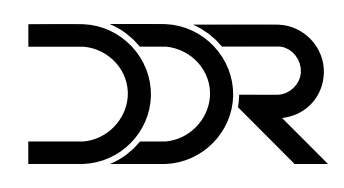

<h1 align="center">
    <h4 align="c
    
</h1>
<h2 align="center">DDR Challenge</h2>


<p>
  
  	
  <a href="https://www.linkedin.com/in/samuelqsouza/">
    
  </a>
   <a href="https://github.com/samuelqsouza/SemanaOmnistack11/commits/master">
    
  </a>


   <a href="https://github.com/SamuelQSouza/ddr-challenge">
    
  </a>


## :information_source: Como usar

Para clonar esta aplicação você precisa ter [Git](https://git-scm.com), [Node.js](https://nodejs.org/) + [NPM](https://www.npmjs.com/) instalado em seu computador.

Em seu terminal:


### Instalando a API
```bash
# Clone este repositorio
$ git clone https://github.com/SamuelQSouza/ddr-challenge

# Entre no diretorio do projeto
$ cd ddr-challenge

# Instale as dependências
$ npm install

#modifique o arquivo .env substituindo a variavel DATABASE_URL
#pela sua url de banco de dados

# execute a API
$ npm start

```
### Rotas

Esta API foi construída com apenas duas rotas, sendo uma para inserir tabulações e a outra para inserir gravações  ambas utilizam o método post e recebem informações em seu corpo no formato json 
```
http://localhost:3333/gravacoes
http://localhost:3333/tabulacoes
```

Made by Samuel Souza :wave: [Get in touch!](https://www.linkedin.com/in/samuelqsouza/)

